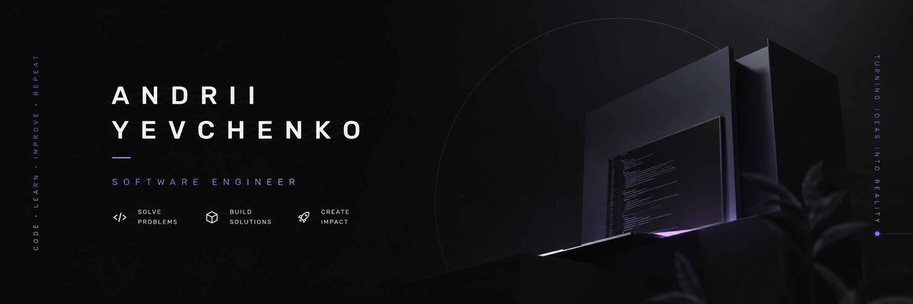

## Hi, I'm Andrii 👋

⚜ Software Engineer from Ukraine.

💡 Turning ideas into products.

🚀 Always learning, always building.

🎯 Focused on growth, quality, and meaningful solutions.

:mailbox: Let's connect!

## 💻 Core Skills:

<!--
**and-yevchenko/and-yevchenko** is a ✨ _special_ ✨ repository because its `README.md` (this file) appears on your GitHub profile.

Here are some ideas to get you started:

- 🔭 I’m currently working on ...
- 🌱 I’m currently learning ...
- 👯 I’m looking to collaborate on ...
- 🤔 I’m looking for help with ...
- 💬 Ask me about ...
- 📫 How to reach me: ...
- 😄 Pronouns: ...
- ⚡ Fun fact: ...
-->
